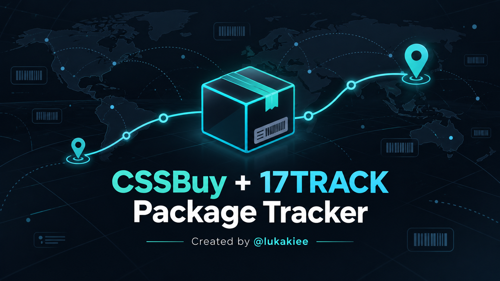

# CSSBuy + 17TRACK Package Tracker



> A clean terminal tracker that combines CSSBuy parcel history with 17TRACK carrier detection and delivery status.

Created by **[@lukakiee](https://www.tiktok.com/@lukakiee)**

## Features

- Shows the parcel's CSSBuy tracking history
- Registers the tracking number with 17TRACK automatically
- Detects and displays the carrier
- Shows current 17TRACK status, latest event, and last sync time
- Handles already-registered 17TRACK parcels without failing
- Keeps API tokens out of the script and does not save them

## What you need

- Python 3
- A CSSBuy account and a current CSSBuy bearer token
- A 17TRACK API account and API token
- Your CSSBuy SID and parcel tracking number (SN)

## Installation

Clone or download this repository, then install the one dependency:

```bash
py -m pip install requests
```

## Run it

From the folder containing the script:

```bash
py cssbuy_17track_tracker.py
```

The tracker prompts for your credentials and parcel details:

```text
CSSBuy token ›
17TRACK token ›
CSSBuy SID ›
Parcel tracking number ›
```

Your tokens are hidden while being entered and are only used for the current run.

## Getting your details

### CSSBuy SID and parcel tracking number

Open the parcel in your CSSBuy account. Copy the **SID** and the parcel's **Tracking Number / SN**.

### 17TRACK API token

Create or sign in to a [17TRACK API account](https://api.17track.net/). In the API dashboard, open **Settings** and copy the API key/token.

### CSSBuy bearer token

Use a current bearer token from your own logged-in CSSBuy account. It may expire; if you receive an authorization error, sign in again and use a new token.

## Troubleshooting

| Message | Fix |
| --- | --- |
| `No module named requests` | Run `py -m pip install requests` |
| CSSBuy authorization error / HTTP 401 | Use a newly generated CSSBuy bearer token |
| “has been registered, don't need to repeat registration” | Normal: the parcel already exists in 17TRACK |
| No CSSBuy record found | Check that both the SID and tracking number are correct |

## Security

Never share or commit API tokens. Every user must use their own CSSBuy and 17TRACK credentials.

## Disclaimer

This is an independent, unofficial community tool created by @lukakiee. It is not affiliated with, endorsed by, or supported by CSSBuy or 17TRACK. Use it responsibly and in accordance with each service's terms.
